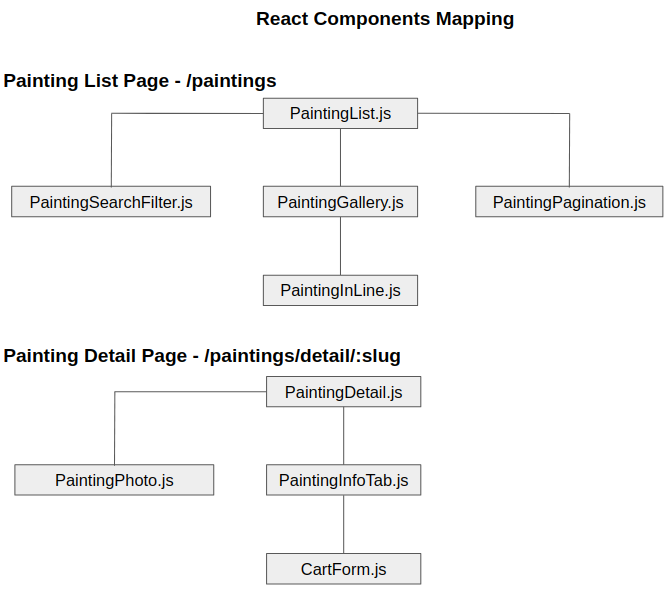
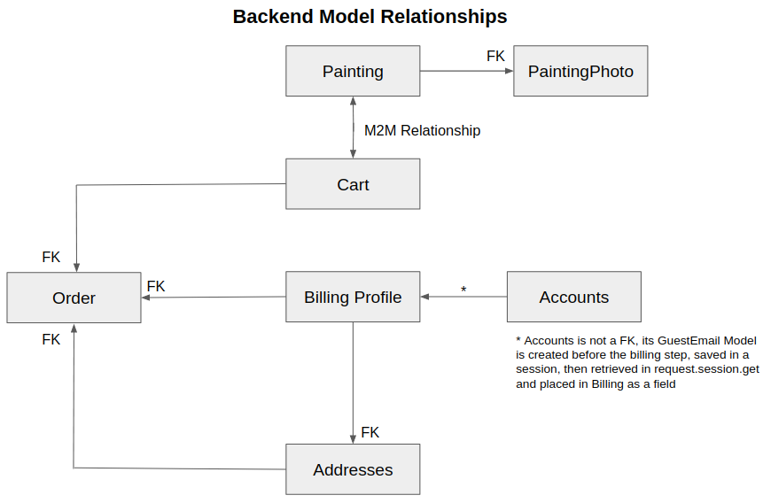
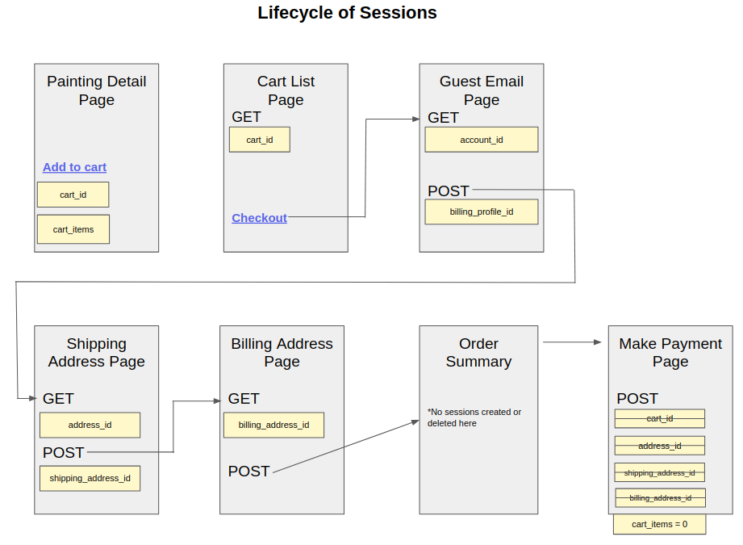
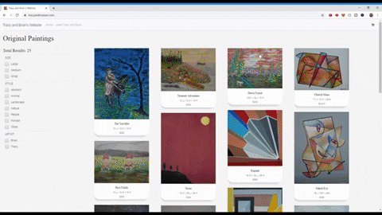

# tracy_and_brian_website

https://tracyandbrianart.com/

E-commerce art website built with React + Django + Django REST Framework. 

- Payments handled via Stripe integration 
- Files served on AWS S3 Bucket
- Deployment on Heroku

 

The sessions helped keep track of the user's cart, shipping & billing information. Majority of the session variables gets deleted after payment is complete.

**Snippet Demo**

Extended video demo here: https://www.youtube.com/watch?v=yrGlLQAesLQ&feature=youtu.be
